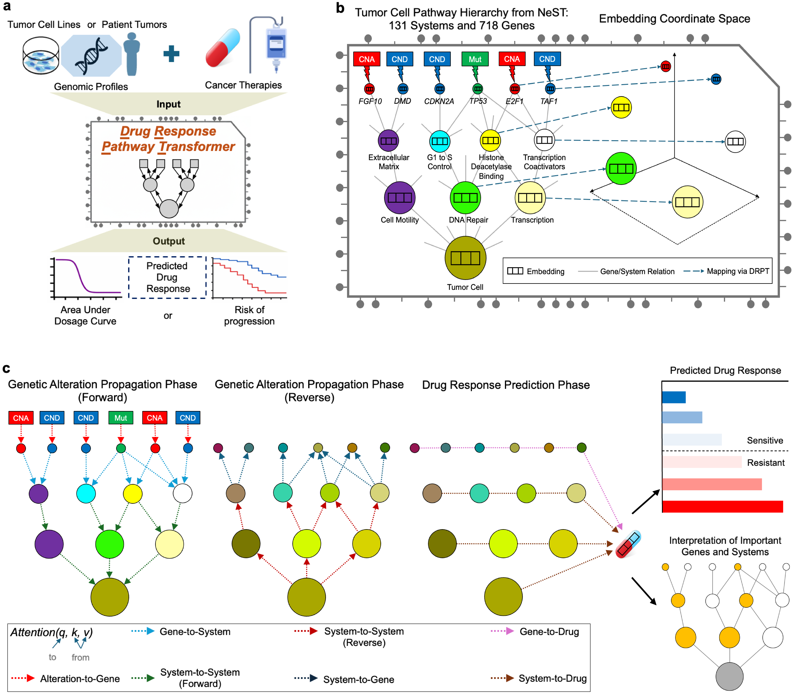

# Drug Response Pathway-Informed Transformer (DRPT)

## Overview

This repository provides code for training an interpretable hierarchical graph transformer for drug-response prediction and precision oncology. DRPT accepts genomic alterations—including mutations, copy-number deletions, and copy-number amplifications—together with a prior-knowledge hierarchy of cellular structures and functions. Attention layers propagate the effects of these alterations through the hierarchy and learn an embedding that represents the state of each gene and cellular system. The model then uses these embeddings to predict drug response.

DRPT is adapted from the related [G2PT model](https://www.biorxiv.org/content/10.1101/2024.10.23.619940v2).



## Environment setup

Create the Conda environment defined in `environment.yml`:

```bash
conda env create --file environment.yml
conda activate g2pt_env
```

## Performance

The [`performance`](performance/) folder contains the notebook used to compare DRPT with baseline models and the serialized performance results for DRPT and the multitask model.

## Patients

The [`patients`](patients/) folder contains the MSK patient-transfer notebook, the patient-transfer training script, and the resulting patient risk scores. This workflow applies the pretrained DRPT representation to patient genomic data and trains a Cox proportional-hazards prediction head.

## Interpretation

The [`interpretation`](interpretation/) folder contains the DRPT interpretation notebook, NeST system mappings, null-importance analysis code, gene and system importance results, epistasis scores, and CRISPR-screen data used for downstream validation.

## Usage

The following are key model hyperparameters:

1. Propagation options:
   - `--mut2gene`: determines whether mutations propagate to genes.
   - `--sys2cell`: determines whether information propagates from systems to the root cell node.
   - `--cell2sys`: determines whether information propagates from the root cell node back to systems.
   - `--sys2gene`: determines whether information propagates from systems back to genes (optional).
   - `--drug_embedding`: determines whether the model learns drug embeddings from random initialization (recommended).
   - `--diff_transformer`: determines whether the model uses differential attention.

2. Model parameters:
   - `--hidden_dims`: embedding and hierarchical-transformer dimension. The recommended value is 128.

3. Training parameters:
   - `--epochs`: number of training epochs. The recommended range is 150–200.
   - `--val_step`: number of training steps between validation runs.
   - `--batch_size`: number of samples processed in each batch. The recommended value is 32; larger values may improve throughput when memory permits.
   - `--z_weight`: sampling weight for extreme values of a continuous phenotype.
   - `--dropout`: dropout rate. The default is 0.2.
   - `--lr`: learning rate. The default is 0.001.
   - `--wd`: weight decay. The default is 0.001.

4. Model input and output:
   - `--model`: path to a previously trained model.
   - `--out`: directory in which trained models will be stored.

## Model training example

See [`DRPT.sh`](DRPT.sh) for an example training command.
