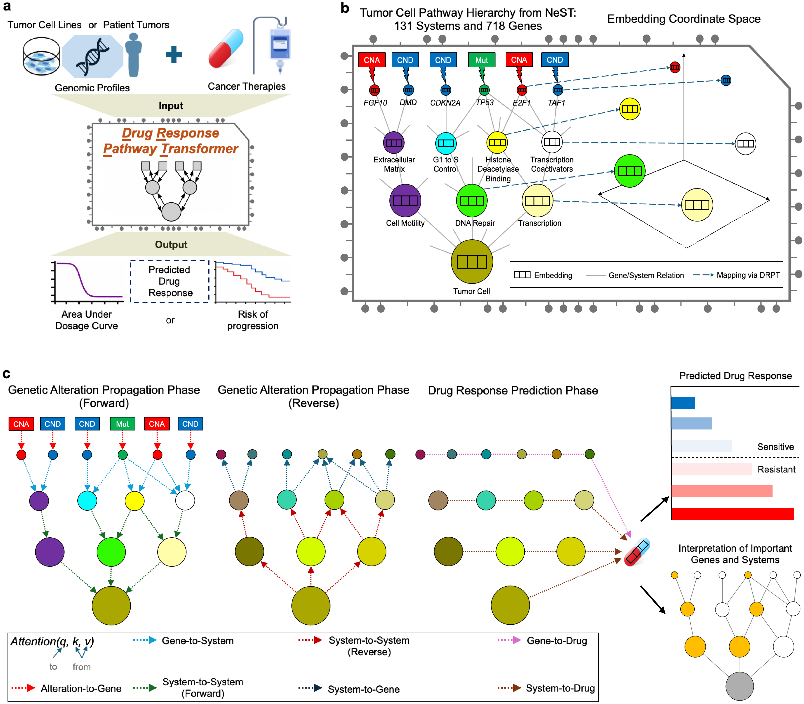

# Drug Response Pathway-Informed Transformer (DRPT)

## Overview

This repository provides code for training an interpretable hierarchical graph transformer for drug-response prediction and precision oncology. DRPT accepts genomic alterations—including mutations, copy-number deletions, and copy-number amplifications—together with a prior-knowledge hierarchy of cellular structures and functions. Attention layers propagate the effects of these alterations through the hierarchy and learn an embedding that represents the state of each gene and cellular system. The model then uses these embeddings to predict drug response.

DRPT is adapted from the related [G2PT model](https://www.biorxiv.org/content/10.1101/2024.10.23.619940v2).



## Environment setup

Create the Conda environment defined in `environment.yml`:

```bash
conda env create --file environment.yml
conda activate g2pt_env
```

## Performance

The [`performance`](performance/) folder contains the notebook used to compare DRPT with baseline models and the serialized performance results for DRPT and the multitask model.

## Patients

The [`patients`](patients/) folder contains the MSK patient-transfer notebook, the patient-transfer training script, and the resulting patient risk scores. This workflow applies the pretrained DRPT representation to patient genomic data and trains a Cox proportional-hazards prediction head.

## Interpretation

The [`interpretation`](interpretation/) folder contains the DRPT interpretation notebook, NeST system mappings, null-importance analysis code, gene and system importance results, epistasis scores, and CRISPR-screen data used for downstream validation.

## Usage

The following are key model hyperparameters:

1. Propagation options:
   - `--mut2gene`: determines whether mutations propagate to genes.
   - `--sys2cell`: determines whether information propagates from systems to the root cell node.
   - `--cell2sys`: determines whether information propagates from the root cell node back to systems.
   - `--sys2gene`: determines whether information propagates from systems back to genes (optional).
   - `--gene2drug`: determines whether the model uses drug embeddings informed by genes in the prediction layer.
   - `--drug_embedding`: determines whether the model learns drug embeddings from random initialization (recommended).
   - `--diff_transformer`: determines whether the model uses differential attention.

2. Model parameters:
   - `--hidden_dims`: embedding and hierarchical-transformer dimension. The recommended value is 128.

3. Training parameters:
   - `--epochs`: number of training epochs. The recommended range is 150–200.
   - `--val_step`: number of training steps between validation runs.
   - `--batch_size`: number of samples processed in each batch. The recommended value is 32; larger values may improve throughput when memory permits.
   - `--z_weight`: sampling weight for extreme values of a continuous phenotype.
   - `--dropout`: dropout rate. The default is 0.2.
   - `--lr`: learning rate. The default is 0.001.
   - `--wd`: weight decay. The default is 0.001.

4. Model input and output:
   - `--model`: path to a previously trained model.
   - `--out`: directory in which trained models will be stored.

## Cell line model training

Two Slurm launchers are provided for training cell-line DRPT models:

- [`DRPT-Evaluate.sh`](DRPT-Evaluate.sh) trains five models using the predefined train, validation, and test splits. These split-specific models are used to evaluate cell-line predictive performance and are written to the `models/` directory.
- [`DRPT-Interpret.sh`](DRPT-Interpret.sh) trains one model on the complete RSI cell-line dataset with no validation or test split. It writes `rsi_model.pt` at the repository root for the downstream model-embedding, attention-weight, and interpretation workflow.

From the repository root, submit the appropriate workflow after creating the `g2pt_env` environment:

```bash
sbatch DRPT-Evaluate.sh
sbatch DRPT-Interpret.sh
```

## MSK-CHORD patient finetuning

[`MSK-Transfer.sh`](MSK-Transfer.sh) fine-tunes the patient prediction head using MSK-CHORD patient data. The pretrained DRPT cell-line model remains frozen while its patient genomic embeddings are transferred to a two-layer multilayer perceptron optimized with a Cox proportional-hazards objective.

From the repository root, activate the project environment and submit the provided Slurm script:

```bash
conda activate g2pt_env
sbatch MSK-Transfer.sh
```

On a compatible machine where Slurm directives are not needed, the script can instead be run with `bash MSK-Transfer.sh`. Outputs are written to the [`patients`](patients/) folder.

## Model interpretation analysis

[`get_model_embeddings_and_weights.py`](get_model_embeddings_and_weights.py) loads the saved [`rsi_model.pt`](rsi_model.pt) checkpoint and performs a forward pass over the complete RSI cell-line dataset. It collects the model predictions, gene and system attention weights, and gene and system embeddings for every drug and saves them as a drug-indexed dictionary in `interpretation/model_results.pkl`. This generated dictionary is used by the analyses in the [`interpretation`](interpretation/) folder.

Run the extraction from the repository root after activating `g2pt_env`:

```bash
python get_model_embeddings_and_weights.py
```

The generated pickle is several gigabytes and is therefore not stored directly in Git. Pass `--help` to view options for the model, dataset, output path, device, batch size, and data-loader workers.
